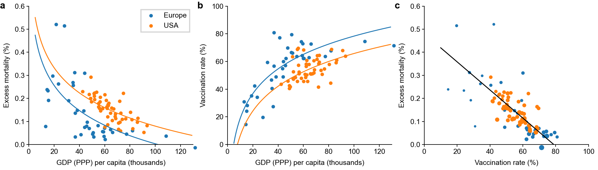
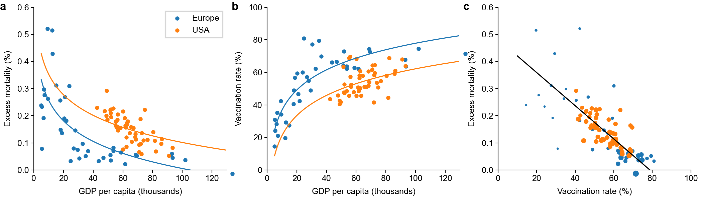

# Modeling the relationship between GDP (PPP), vaccination rate, and excess mortality during Covid-19 pandemic across European countries and U.S. states

Using PPP-adjusted GDP per capita:

Using unadjusted GDP per capita:

